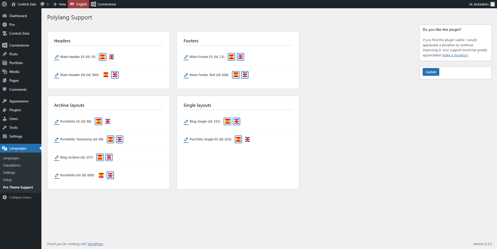

# Polylang Theme.co Integration

A simple plugin that integrates Polylang multilanguage plugin with Theme.co's Pro theme and Cornerstone layout elements.

## Information

**Contributors:** ControlZetaDigital 
**Tags:** polylang, integrator, multilanguage, support, tco, themeco, pro, theme, cornerstone 
**Requires at least:** 3.3 
**Tested up to:** 6.1 
**Requires PHP:** 7.4 
**Stable tag:** 1.0 
**License:** GPLv3 
**License URI:** https://www.gnu.org/licenses/gpl-3.0.html

## Description

A simple plugin that integrates [Polylang](https://polylang.pro/) multilanguage plugin with layout, headers and footers contents created with Cornerstone builder in Pro themes by [Theme.co](https://theme.co/pro)

## Installation 

For detailed installation instructions, please read the [standard installation procedure for WordPress plugins](https://codex.wordpress.org/Managing_Plugins#Installing_Plugins).

1. Make sure [Polylang](https://polylang.pro/) and [Pro Theme](https://theme.co/pro) are installed and running.
2. Install and activate plugin.

## How to use

Assign each active language with Pro elements you have made in settings. You can find this plugin's settings in Wordpress admin menu *Languages* -> *Pro Theme Support*.

You can assign each CS element to one or multiple active languages. Just click on the flag to select or deselect the assignment. The native CS assignment will be applied alongside the language assignment of this plugin, so if you have multiple elements of the same type assigned to the same language, the assignment conditions and priorities you have defined in CS will be applied.

## Screenshots

1. Plugin settings

## Do you wanna help?

If you want to collaborate in improving this plugin and have any ideas to do so, feel free to clone this repository, create your own branch, and make your pull requests.

Also, if you've found it helpful and want to help me continue improving it, you can make a [donation here](https://donate.stripe.com/4gwg177xifrsfSgcMN).

## Changelog

### 1.1.0
 - Language assignment improved in order to assign a language to each Cornerstone element (headers, footers and layouts) and mantain CS native assignments.
 - Minor updates in plugin's file/directory structure and documentation.

### 1.0.0
 - Initialized project.